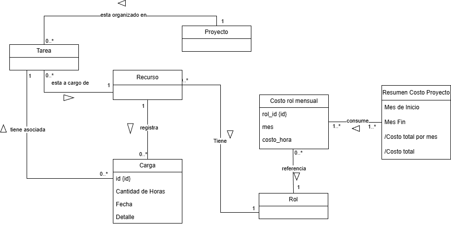

# Modelo de Dominio

## Información del Documento

| Campo                    | Valor                     |
| ------------------------ | ------------------------- |
| **Módulo** | Carga de Horas y Finanzas |
| **Tribu** | F                         |
| **Fecha de creación** | 30/11/2025                |
| **Última actualización** | 30/11/2025                |

## Diagrama del Modelo de Dominio

_Diagrama del modelo de dominio para el módulo de Carga de Horas y Finanzas_

## Entidades del Dominio

### Proyecto
- **Descripción:** Representa la iniciativa o trabajo global sobre el cual se imputan horas y costos.
- **Responsabilidades:** Agrupar tareas y mantener la referencia de los costos mensuales.
- **Atributos principales:** `id`, `nombre`, `descripción` (Ver Nota 1).

### Tarea
- **Descripción:** Unidad de trabajo específica dentro de un proyecto.
- **Responsabilidades:** Permitir la asignación de recursos y la asociación de cargas de horas.
- **Atributos principales:** `id`, `nombre`, `estado` (Ver Nota 1).

### Recurso
- **Descripción:** Persona o entidad que realiza el trabajo.
- **Responsabilidades:** Estar a cargo de tareas y registrar las cargas de horas trabajadas.
- **Atributos principales:** `id`, `nombre`, `apellido` (Ver Nota 1).

### Rol
- **Descripción:** Función o categoría profesional del recurso (ej. Desarrollador, QA).
- **Responsabilidades:** Definir la categoría para determinar el costo por hora en los periodos mensuales.
- **Atributos principales:** `id`, `nombre_rol` (Ver Nota 1).

### Carga
- **Descripción:** Registro detallado del tiempo invertido por un recurso en una tarea.
- **Responsabilidades:** Almacenar la cantidad de horas, la fecha y el detalle del trabajo realizado.
- **Atributos principales:** `id`, `Cantidad de Horas`, `Fecha`, `Detalle`.

### Costo proyecto mensual
- **Descripción:** Entidad que agrupa los costos financieros de un proyecto para un mes específico.
- **Responsabilidades:** Consolidar el costo mensual y vincularse con las cargas horarias correspondientes.
- **Atributos principales:** `proyecto_id`, `mes`, `costo_mensual`.

### Costo rol mensual
- **Descripción:** Define el valor monetario de un rol específico en un mes determinado (tarifario temporal).
- **Responsabilidades:** Establecer cuánto cuesta la hora de un rol en un periodo específico.
- **Atributos principales:** `rol_id`, `mes`, `costo_hora`.

### Resumen Costo Proyecto
- **Descripción:** Entidad de reporte o vista agregada.
- **Responsabilidades:** Calcular y mostrar los totales financieros en un rango de fechas.
- **Atributos principales:** `Mes de Inicio`, `Mes Fin`, `/Costo total por mes`, `/Costo total`.

## Relaciones entre Entidades

| Entidad Origen         | Relación             | Entidad Destino        | Descripción                                                                 |
| ---------------------- | -------------------- | ---------------------- | --------------------------------------------------------------------------- |
| **Proyecto** | esta organizado en   | **Tarea** | Un proyecto se descompone en muchas tareas.                                 |
| **Proyecto** | referencia           | **Costo proy mensual** | Un proyecto tiene un registro de costos por cada mes.                       |
| **Tarea** | tiene asociada       | **Carga** | Una tarea puede tener múltiples registros de carga de horas.                |
| **Recurso** | esta a cargo de      | **Tarea** | Un recurso es responsable de una o varias tareas.                           |
| **Recurso** | registra             | **Carga** | Un recurso crea múltiples registros de carga de horas.                      |
| **Recurso** | Tiene                | **Rol** | Un recurso posee un rol específico asociado.                                |
| **Rol** | referencia           | **Costo rol mensual** | Un rol puede tener diferentes costos dependiendo del mes.                   |
| **Carga** | Utiliza              | **Costo proy mensual** | Las cargas de horas contribuyen al cálculo de un costo mensual de proyecto. |
| **Costo proy mensual** | usa                  | **Costo rol mensual** | El costo del proyecto usa los costos de roles definidos para ese mes.       |
| **Costo rol mensual** | consume              | **Resumen Costo Proy** | El resumen consume varios costos de roles para calcular totales.            |

## Diccionario de Datos

| Entidad                | Atributo              | Descripción                                       | Tipo Primitivo |
| ---------------------- | --------------------- | ------------------------------------------------- | -------------- |
| **Proyecto** | id                    | Identificador único del proyecto (Implícito).     | Integer (PK)   |
| **Proyecto** | nombre                | Nombre descriptivo del proyecto (Implícito).      | String         |
| **Tarea** | id                    | Identificador único de la tarea (Implícito).      | Integer (PK)   |
| **Carga** | id                    | Identificador único de la carga.                  | Integer (PK)   |
| **Carga** | Cantidad de Horas     | Tiempo dedicado a la tarea.                       | Decimal        |
| **Carga** | Fecha                 | Día en que se realizó la carga.                   | Date           |
| **Carga** | Detalle               | Descripción textual del trabajo realizado.        | String         |
| **Costo proy mensual** | proyecto_id           | Identificador del proyecto asociado.              | Integer (FK)   |
| **Costo proy mensual** | mes                   | Mes y año al que corresponde el costo.            | Date/String    |
| **Costo proy mensual** | costo_mensual         | Valor monetario acumulado del mes.                | Money/Decimal  |
| **Costo rol mensual** | rol_id                | Identificador del rol asociado.                   | Integer (FK)   |
| **Costo rol mensual** | mes                   | Mes de vigencia del costo.                        | Date/String    |
| **Costo rol mensual** | costo_hora            | Valor de la hora para ese rol en ese mes.         | Money/Decimal  |
| **Resumen Costo Proy** | Mes de Inicio         | Inicio del rango de reporte.                      | Date           |
| **Resumen Costo Proy** | Mes Fin               | Fin del rango de reporte.                         | Date           |
| **Resumen Costo Proy** | /Costo total por mes  | Atributo derivado. Sumatoria calculada por mes.   | Money/Decimal  |
| **Resumen Costo Proy** | /Costo total          | Atributo derivado. Sumatoria total del rango.     | Money/Decimal  |

## Notas Adicionales

1.  **Nota sobre Atributos Implícitos:** Las entidades `Proyecto`, `Tarea`, `Recurso` y `Rol` se han documentado incluyendo atributos de identificación (`id`) y descriptivos (`nombre`) necesarios para garantizar la integridad referencial y la funcionalidad lógica del sistema, aunque estos no se encuentren explícitamente detallados en el diagrama visual original.
2.  **Atributos Derivados:** Los atributos marcados con `/` en la entidad `Resumen Costo Proyecto` son calculados en tiempo de ejecución.
3.  **Histórico de Costos:** El modelo soporta la variación de costos de recursos a lo largo del tiempo mediante la entidad `Costo rol mensual`.

---

**Versión:** 1.0  
**Estado:** En revisión